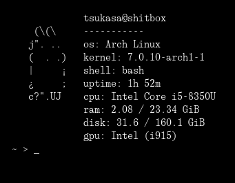

# gfetch

gfetch is a re-implementation of [Glenda Fetch by arwm](https://github.com/arwn/gfetch) for Linux in the C programming language.

# Installation

<details>
<summary>conventional make</summary>

```sh
make (add 'STATIC=1' to statically link it)
sudo/doas make install   
```
</details>

<details>
<summary>Plan9Port mk</summary>

```sh
mk
sudo/doas mk install   
```
</details>


# Preview



# Checklist

- [ ] Multi-monitor fetch 
- [ ] Multi-partiton fetch 
- [ ] Wayland compositor/X window manager fetch

# License

GPL-v3
